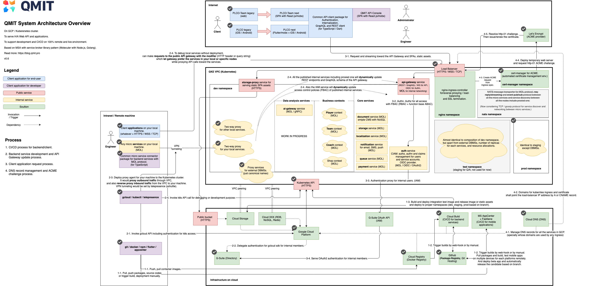

# QMIT 개발자 핸드북

TODO

### 시스템 아키텍처 개요

[edit](https://www.draw.io/#G1XrFw4Qm9a54msOk79bHbsB74prlXYHeB)

### 개발 조직 및 로드맵 개요

- **Infrastructure** (오픈소스)
    - 개발 인프라 관리 및 전파
        - Kubernetes 관리
        - 사내 IAM 관리
        - 네트워크 보안 및 클라우드 자원 관리
        - 개발 환경 구축 및 다중화
        - DMBS 및 서비스 다중화
        - CI/CD 및 개발 프로세스 설계
        - MSA 아키텍처 및 서비스간 네트워크 인터페이스 설계/개발
        - Backend/Core 팀 개발 지원
        - 기타 IT 자원 관리
    - 장애 대응 및 재해 예방
    - 각종 문서 관리
    - Vault 인프라 구축 및 접근 제어 관리, 전파
- **Backend**
    - **Core**
        - **기반 서비스** (오픈소스)
            - 공유 라이브러리 개발 및 전파
                - Web/Mobile(Flutter) API Client 패키지 개발 및 전파
                - MSA 서비스 브로커 (with [moleculerjs](https://moleculer.services/)) 패키지 개발 및 전파
            - Public API Gateway 서비스
                - GraphQL / REST / WebSocket
                - Dynamic endpoint update 시스템
            - Admin Console 서비스
                - 기반 서비스 관리
                - API 문서 생성
            - IAM, CIAM 서비스
                - G-Suite / Firebase 연동
                - OIDC Provider (OAuth)
                - RBAC
                - Dynamic Access Control Interpreter (FBAC)
            - Payment 서비스
                - IAMPort 연동
            - Notification 서비스
                - SMTP
                - Kakao
                - Jandi
                - Mobile Push
                - 채널 및 템플릿 관리
            - Storage 서비스
                - Cloud Storage 연동
                - Streaming/GraphQL/REST
            - Queue 서비스
            - CMS 서비스
            - I18N 서비스
    - **Business**
        - Sports 컨텍스트
        - Shop 컨텍스트
    - **Data Analysis**
        - AI Gateway 서비스 (하위 시스템을 사내 MSA 인터페이스로 프록시)
        - Business 서비스에 필요 모델 정의 및 모델링 (pytorch || tensorflow)
        - ML 데이터 파이프라인 설계 및 온라인 러닝 시스템 구축
- **Client**
    - **Mobile**
        - Flutter 제품 개발 및 테스트 (iOS/Android both)
        - 사내 Flutter 컴포넌트 유지보수
    - **Web**
        - Admin Console 애플리케이션 (오픈소스)
            - dev/staging/production 환경 지원
            - API Gateway 연동
            - AI Gateway 연동
            - 주요 Utility 서비스 연동
                - IAM/CIAM/Notification 등
        - React.js 제품 개발 및 테스트
        - 사내 React.js 컴포넌트 유지보수

### 공통 개발 환경 구성 및 개발 프로세스 안내
- System architecture overview
- JS, TS, Dart, Node, Golang, Python, Java
- G-Suite, GitHub, AppCenter
- gcloud, docker, kubectl, telepresence, git, vault
- about NO local configuration policy
- about no development mode policy
- about k8s and devops, permission and responsibility for each role, and CI/CD
- about documentation and communication
- about testing and coverage policy, PR, code review
- about Design team and co-working process

### 팀별 개발 환경 구성 및 개발 프로세스 안내
- [Infra Team](./infra)
- [Backend Team](./backend)
- [Client Team](./client)
